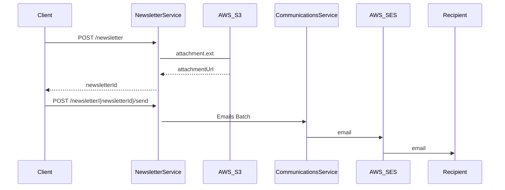
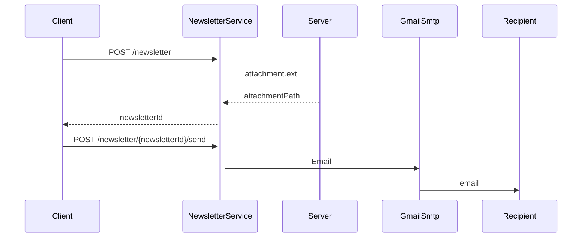
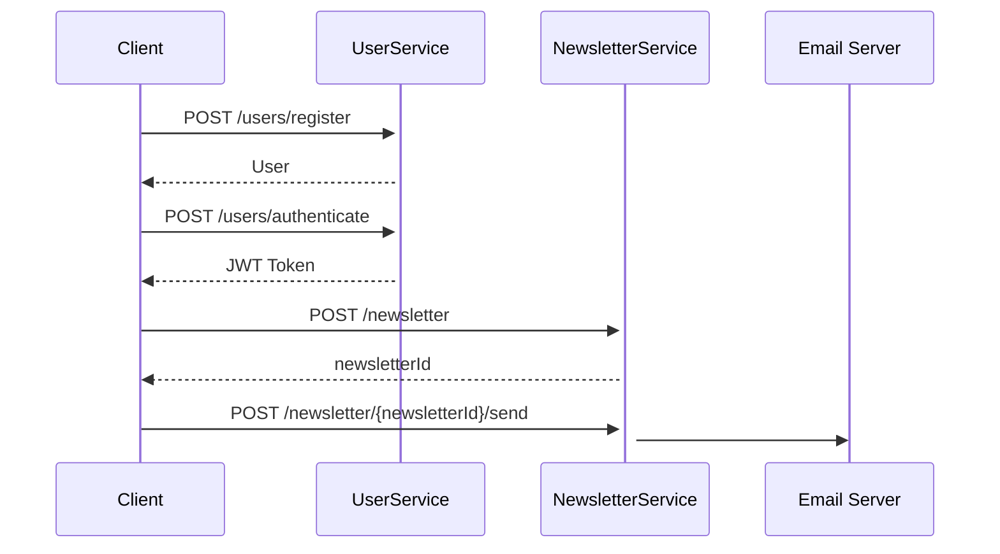
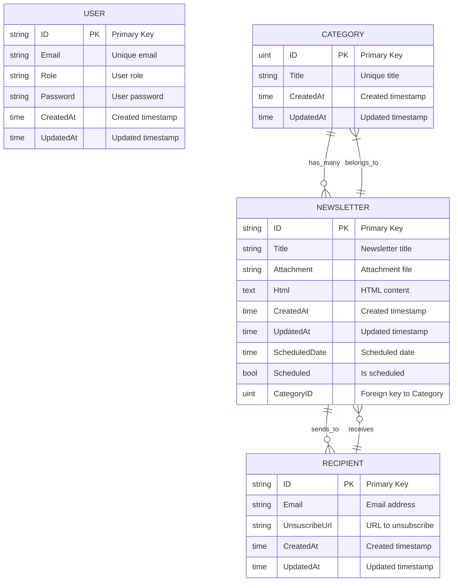

# Stori Challenge

This Email Newsletter Service allows users to easily send newsletters to their subscribers.

Key Features:
Create Newsletters: Design and customize newsletters with ease.
Send Emails: Quickly send newsletters to your subscribers.

## Table of Contents

- [Prerequisites](#prerequisites)
- [Installation](#installation)
- [Architecture](#architecture)

## Prerequisites

Before running the project, ensure you have the following installed on your machine:

- [Docker](https://docs.docker.com/get-docker/)
- [Docker Compose](https://docs.docker.com/compose/install/)
- [Git](https://git-scm.com/book/en/v2/Getting-Started-Installing-Git)

## Installation

Before proceeding with the installation, you need to configure the environment variables.

1. Clone the repo:
   ``git clone https://github.com/jocaris/stori_challenge.git``

2.  Set up the environment variables in the following files:
   	- ./challenge/newsletter-service/.env.example
	* ./challenge/user-service/.env.example
	+ ./challenge/client/.env.example
	- ./challenge/.env.example

	For details on where to obtain these environment variables or their functions, refer to:
	* ./challenge/doc/envs.md

4. Run docker services:
 ``docker compose build && docker compose up -d``

5. Go to http://localhost:3000 in you browser

	Be aware of the ports that are being forwarded from the docker containers: 
	- PORT = 3000 // Client
	* PORT = 4000 // User Service
	+ PORT = 4500 // Newsletter Service
	- PORT = 5432 // User Service DB
	* PORT = 5433 // Newsletter Service DB

6. To stop the containers run:
 ``docker compose down``

## Architecture

### Client UI

### Initial Approach

### Final Approach

### Happy Path

### Data Models

###End
